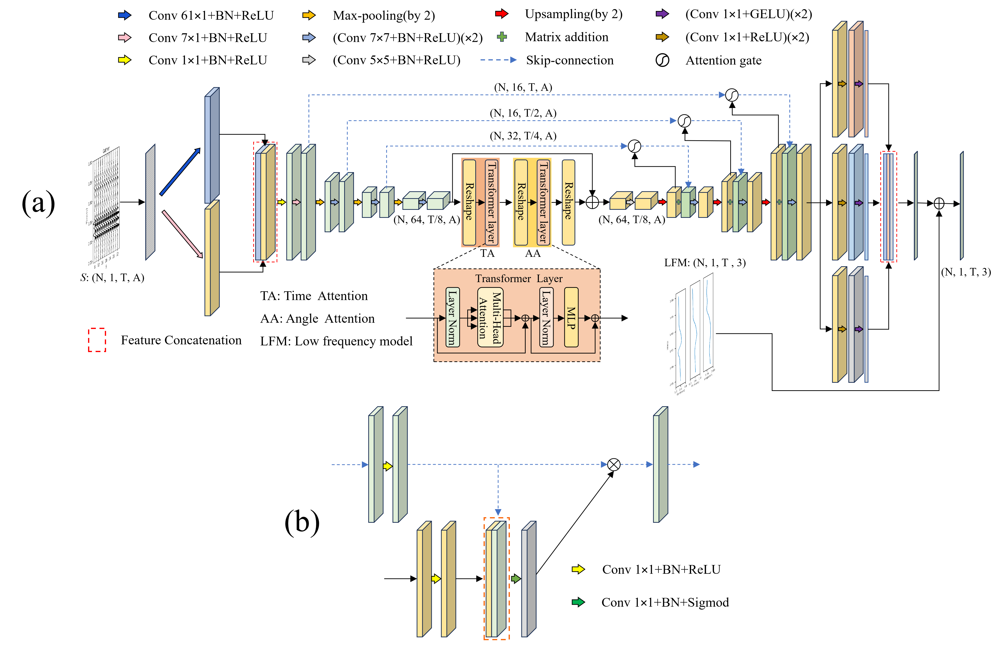

# TADAU-MODEL

### **What is this repository for?**
TADAU-MODEL is a software for paper 《Time-Angle Dual Attention U-Net for Prestack Seismic Inversion of Gas Hydrate Reservoirs》.

### Who do I talk to?

Dajiang Meng;

a. Key Laboratory of Marine Mineral Resources, Ministry of Natural Resources, Guangzhou Marine Geological Survey, China Geological Survey, Guangzhou, China;

b. National Engineering Research Center for Gas Hydrate Exploration and Development, Guangzhou Marine Geological Survey, China Geological Survey, Guangzhou, China;

E-mail:dajiang623@163.com

### Usage

Time-Angle Dual Attention U-Net for Prestack Seismic Inversion
TADAU_model.py: Network structure of the proposed Time-Angle Dual Attention U-Net (TADAU) model.
Unet_model.py: Structure of the conventional U-Net model for comparison.
train_TADAU.py: Training script for the TADAU model.
train_Unet.py: Training script for the baseline U-Net model.
train_function.py: Defines loss functions for semi-supervised learning and geophysical constraint regularization.
AVO_tensor.py: Implements the Zoeppritz equations and seismic convolution model.
Transform.py: Auxiliary module for TADAU_model.py, responsible for Transformer self-attention calculation.
